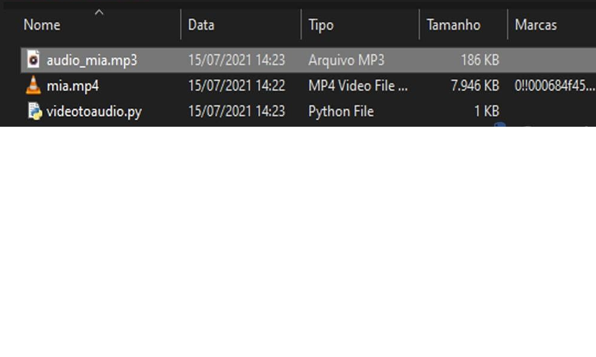

# video_to_audio_converter
 video to audio mp3 converter


 # install

```
$ pip install requirements.txt
```


> o arquivo .mp4 que queria fazer a extração tem que esta no mesmo lugar que a pasta raiz do projeto.
> ex:

